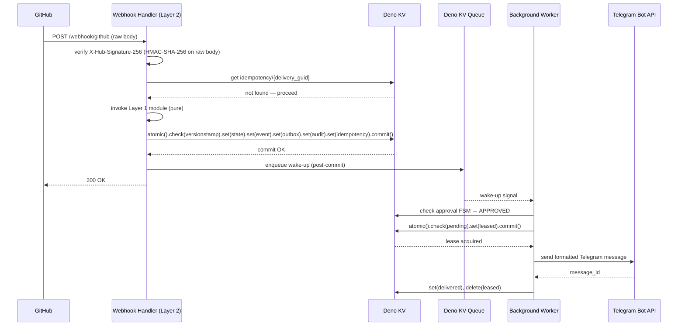
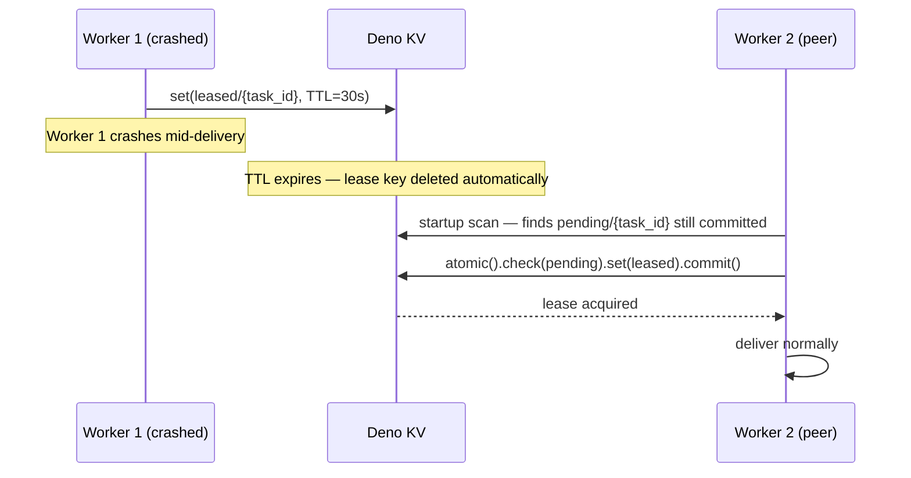

# STOS V2.3.2

A **Telegram Community & Operations Platform** built on Deno. Deterministic execution, atomic Deno KV transactions, transactional outbox, optimistic concurrency, idempotent processing, immutable audit logging, and strict separation between intent, state mutation, and external effects.

---

## 🏗️ Architecture: Three-Layer Design

### Layer 1: Internal Modules (Intent Only)

Pure business logic — **no state mutations, no API calls, no credential access**.

Each module produces:
- `Intent` — what should happen
- `ExecutionPlan` — how to execute it
- `StateTransition` — next FSM state
- `DomainEvent` — what changed
- `OutboundIntent` — delivery instructions

| Module | Responsibility |
|--------|----------------|
| **Content Module** | Draft, preview, publish, archive posts & media |
| **Button Module** | Generate all inline keyboards & navigation UI |
| **Automation Module** | Scheduling, reminders, broadcasts, workflows |
| **Community Module** | Member onboarding, rules, polls, forums |
| **Customer Service Module** | FAQ, guides, tickets, escalation |
| **Delivery Module** | Produce outbound delivery intents (no API calls) |

### Layer 2: Runtime Services (Mutation Boundary)

**The only layer allowed to change data.** Reads credentials. Executes the deterministic pipeline. Performs the atomic commit.

### Layer 3: External Integrations (Effects Only)

**No state mutations.** Only executes effects.

- Telegram Bot API
- GitHub App API
- Deno KV / Deno KV Queue
- HTTPS Webhooks

---

## 🔄 Atomic Commit Rule

Every execution commits **exactly five categories** in **one** `kv.atomic()` transaction:

```typescript
await kv.atomic()
  // Optimistic concurrency — fails if entity was modified since we read it
  .check({ key: ["state", ...entityKey], versionstamp: currentVersionstamp })
  .set(["state",       ...entityKey],          { ...newFsmState, revision: currentRevision + 1 })
  .set(["events",      ...eventKey],           domainEvent)
  .set(["outbox",      "pending", taskId],     outboundIntent)  // written here, never before
  .set(["audit",       ...auditKey],           auditLogEntry)
  .set(["idempotency", deliveryId],            { processedAt: Date.now() })
  .commit();
// On success  → return HTTP 200, then enqueue wake-up notification
// On failure  → retry from state fetch with new versionstamp
```

**Rules:**
- ✅ Return `200 OK` only after a successful commit — never before
- ❌ Never call Telegram or GitHub APIs inside a webhook handler
- ❌ Never write the outbox record before the transaction commits
- ❌ Never pass credentials into a Layer 1 module

---

## 📊 Finite State Machines

Transition matrices are enforced in Layer 2 before the atomic commit is constructed. Any transition not marked ✅ is rejected.

### Content Lifecycle

| FROM ↓ \ TO → | `DRAFT` | `PREVIEW` | `PUBLISHED` | `ARCHIVED` |
|----------------|---------|-----------|-------------|------------|
| `DRAFT`        | —       | ✅        | ❌          | ✅         |
| `PREVIEW`      | ✅      | —         | ✅          | ✅         |
| `PUBLISHED`    | ❌      | ❌        | —           | ✅         |
| `ARCHIVED`     | ❌      | ❌        | ❌          | —          |

### Support Tickets

| FROM ↓ \ TO → | `OPEN` | `ASSIGNED` | `IN_PROGRESS` | `RESOLVED` | `CLOSED` |
|----------------|--------|------------|---------------|------------|----------|
| `OPEN`         | —      | ✅         | ❌            | ❌         | ✅       |
| `ASSIGNED`     | ✅     | —          | ✅            | ❌         | ✅       |
| `IN_PROGRESS`  | ❌     | ✅         | —             | ✅         | ✅       |
| `RESOLVED`     | ❌     | ❌         | ✅            | —          | ✅       |
| `CLOSED`       | ❌     | ❌         | ❌            | ❌         | —        |

### Community Members

| FROM ↓ \ TO → | `PENDING` | `APPROVED` | `ACTIVE` | `BANNED` |
|----------------|-----------|------------|----------|----------|
| `PENDING`      | —         | ✅         | ❌       | ✅       |
| `APPROVED`     | ❌        | —          | ✅       | ✅       |
| `ACTIVE`       | ❌        | ❌         | —        | ✅       |
| `BANNED`       | ❌        | ✅         | ❌       | —        |

### GitHub Event Approval

| FROM ↓ \ TO →  | `PENDING` | `UNDER_REVIEW` | `APPROVED` | `DELIVERING` | `DELIVERED` | `REJECTED` |
|----------------|-----------|----------------|------------|--------------|-------------|------------|
| `PENDING`      | —         | ✅             | ❌         | ❌           | ❌          | ✅         |
| `UNDER_REVIEW` | ✅        | —              | ✅         | ❌           | ❌          | ✅         |
| `APPROVED`     | ❌        | ❌             | —          | ✅           | ❌          | ❌         |
| `DELIVERING`   | ❌        | ❌             | ❌         | —            | ✅          | ❌         |
| `DELIVERED`    | ❌        | ❌             | ❌         | ❌           | —           | ❌         |
| `REJECTED`     | ❌        | ❌             | ❌         | ❌           | ❌          | —          |

The background worker reads the approval FSM state before proceeding. It does not mutate the outbox entry — it waits until the FSM reaches `APPROVED`.

---

## 🔗 GitHub App Integration

### Credential Storage and Isolation

GitHub App credentials are stored under `storage/system/` and are read **only** by Layer 2 at JWT generation time. They are never passed into a Layer 1 module.

```
storage/system/
  github/
    app_id               # GitHub App ID
    webhook_secret       # HMAC-SHA-256 verification secret
    private_key          # PEM — read by Layer 2 only, never exposed to Layer 1
```

GitHub-to-Telegram identity mappings are stored under `storage/users/`:

```
storage/users/
  {user_id}/
    github_identity      # GitHub login, node_id, installation_id
    telegram_identity    # Telegram user_id, username
```

### GitHub Webhook Pipeline (9 Steps)

```
1. Receive raw HTTP body       Store unmodified — signature verification requires the raw bytes
2. Verify X-Hub-Signature-256  HMAC-SHA-256 against raw body using webhook_secret — reject immediately on failure
3. Read X-GitHub-Delivery      This is the unique delivery GUID and the idempotency key
4. Check idempotency           Read storage/idempotency/{delivery_guid} — return 200 if already committed
5. Build execution context     Immutable snapshot — parsed payload, verified headers, resolved identity
6. Invoke Layer 1 module       Pure business logic — returns intent, no credentials, no side effects
7. Atomic commit               Five categories: state, event, outbox ref, audit, idempotency key
8. Return HTTP 200             Only after successful commit — never before
9. Enqueue wake-up             Signal background worker that new outbox work exists
```

> ⚠️ `X-Hub-Signature-256` must be verified against the **raw unmodified request body** before any JSON parsing. Parsing first and re-serialising will produce a different byte sequence and cause legitimate requests to fail verification.

### Event Store vs Outbox Separation

Inbound GitHub payloads are **not** written directly to the outbox. They are archived in a dedicated immutable event store:

```
storage/events/
  github/
    {delivery_guid}/
      payload            # Raw verified JSON body
      headers            # X-GitHub-Event, X-GitHub-Delivery, Content-Type
      received_at        # Unix timestamp
      verified           # true — set only after HMAC-SHA-256 passes
```

The outbox entry contains only the delivery work — a pointer to the event, not the payload:

```
storage/outbox/
  pending/
    {task_id}/
      source             # "github"
      event              # e.g. "pull_request.opened"
      event_ref          # "storage/events/github/{delivery_guid}"
      target             # "telegram"
      approval_fsm_ref   # "storage/state/github_approval/{delivery_guid}"
```

This keeps the outbox strictly a delivery queue and the event store strictly an immutable archive.

### Hash Distinction

Two hashes serve two distinct purposes and must not be conflated:

| Hash | Algorithm | Purpose | When computed |
|------|-----------|---------|---------------|
| Request authentication | HMAC-SHA-256 (webhook secret) | Verifies GitHub sent the payload | Step 2 — before any processing |
| Audit integrity | SHA-256 (canonical payload) | Immutable fingerprint in audit record | After verification, written at commit |

### End-to-End GitHub → Telegram Flow

```
GitHub Event
  ↓
POST /webhook/github
  ↓
Raw body received (unmodified)
  ↓
X-Hub-Signature-256 verified (HMAC-SHA-256)
  ↓
X-GitHub-Delivery read → idempotency check
  ↓
Layer 1 module (pure intent)
  ↓
Atomic commit ─────────────────────┐
  ├── state (approval FSM)         │
  ├── event (storage/events/)      │  all five or none
  ├── outbox (event_ref pointer)   │
  ├── audit (SHA-256 fingerprint)  │
  └── idempotency (delivery_guid) ─┘
  ↓
HTTP 200
  ↓
Worker wakes → reads approval FSM
  ↓
  ├── APPROVED → format for Telegram → Telegram Bot API → mark DELIVERED
  └── PENDING / UNDER_REVIEW → wait
```

---

## 💾 Storage Hierarchy

```
storage/
├── system/
│   ├── github/
│   │   ├── app_id
│   │   ├── webhook_secret
│   │   └── private_key          # Layer 2 only — never Layer 1
│   └── telegram/
│       └── bot_token            # Layer 2 only — never Layer 1
│
├── users/
│   └── {user_id}/
│       ├── profile
│       ├── fsm
│       ├── github_identity
│       └── telegram_identity
│
├── events/                      # Immutable inbound event archive
│   └── github/
│       └── {delivery_guid}/
│           ├── payload
│           ├── headers
│           ├── received_at
│           └── verified
│
├── outbox/                      # Transactional delivery queue only
│   ├── pending/{task_id}
│   ├── leased/{task_id}
│   ├── delivering/{task_id}
│   ├── delivered/{task_id}
│   ├── failed/{task_id}
│   └── dead/{task_id}
│
├── state/
│   ├── github_approval/{delivery_guid}   # Approval FSM
│   ├── content/{post_id}
│   ├── tickets/{ticket_id}
│   └── members/{user_id}
│
├── audit/
│   └── {timestamp}_{uuid}               # Immutable — never deleted
│
└── idempotency/
    └── {delivery_guid}                  # TTL-based replay protection
```

---

## 🚚 Delivery Model: Transactional Outbox + Queue

```
Atomic KV Commit
  ↓
storage/outbox/pending/{task_id}    ← durable source of truth
  ↓
Runtime enqueues wake-up (post-commit only)
  ↓
Deno KV Queue notification          ← wake-up signal only
  ↓                                 ↑ if lost: worker scans /pending on startup
Worker acquires lease               ← atomic check() — one winner per task
  ↓
Read approval FSM                   ← GitHub events only
  ↓
storage/outbox/delivering/{task_id}
  ↓
Telegram Bot API
  ↓
  ├─ Success → /delivered
  └─ Failure → retry (max 5) → /dead
```

### Retry Policy

| Parameter | Value |
|-----------|-------|
| Max attempts | 5 |
| Backoff | Exponential + ±25% jitter: 1s → 2s → 4s → 8s → 16s |
| On exhaustion | Promote to `/dead`, emit `DELIVERY_EXHAUSTED` domain event, write audit entry |
| Dead-letter TTL | 7 days |

### Worker Lease Semantics

| Property | Behaviour |
|----------|-----------|
| Acquisition | `kv.atomic().check()` on pending record — one winner only |
| TTL | 30 seconds |
| Renewal | Worker renews if Telegram API call exceeds 15 s |
| Expiry | Returns task to `pending`; peer worker may claim |
| Stale cleanup | Startup scan promotes expired leased records back to `pending` |

---

## 🔀 Sequence Diagrams

### Normal GitHub → Telegram Delivery



### Crash Recovery



---

## ⚖️ Horizontal Scaling

Workers coordinate exclusively via Deno KV atomic compare-and-swap. No external lock service, message broker, or Redis.

```
Webhook isolates (Deno Deploy edge)   stateless — scale to zero
  ↓ writes to
Deno KV (managed, replicated)         single source of truth
  ↑ read by
Background workers (Deno Deploy)      scale horizontally — CAS coordination only
```

Adding or removing workers requires no reconfiguration.

---

## 🔐 Security Model

**Inbound validation (both Telegram and GitHub):**
- Webhook secret validated before any processing (`X-Telegram-Bot-Api-Secret-Token` / `X-Hub-Signature-256`)
- GitHub: verified against **raw unmodified body** — parsed before verification is rejected
- Payload size limits enforced before parsing
- Request timeouts enforced
- Idempotency keys carry a TTL — expired delivery IDs are rejected

**Access control:**
- Private key and bot token: Layer 2 only, never Layer 1
- Role-based access: OWNER / MEMBER / GUEST validated before module invocation
- Optimistic concurrency: `versionstamp` check on every atomic commit
- Rate limiting: per-user and per-tenant before module invocation

**Data integrity:**
- HMAC-SHA-256 authenticates the request source
- SHA-256 fingerprints the canonical payload in the audit record — these are distinct and not interchangeable
- Audit log: written atomically, never modified or deleted
- Idempotency keys block duplicate processing at step 4

---

## 🔭 Observability

**Webhook pipeline fields (written at commit):**

| Field | Purpose |
|-------|---------|
| `request_id` | Unique ID for this HTTP request |
| `correlation_id` | Trace ID spanning pipeline and worker delivery |
| `delivery_guid` | GitHub/Telegram delivery ID (idempotency key) |
| `bot_id` | Telegram Bot ID or GitHub App ID |
| `tenant_id` | Tenant scope |
| `execution_duration_ms` | Total pipeline time |
| `commit_latency_ms` | Deno KV atomic transaction time |

**Worker delivery fields (written per attempt):**

| Field | Purpose |
|-------|---------|
| `outbox_task_id` | Stable delivery task ID across all attempts |
| `worker_id` | Worker identity |
| `worker_attempt` | Attempt number (1–5) |
| `queue_latency_ms` | Commit → lease acquisition time |
| `telegram_api_latency_ms` | Telegram Bot API round-trip |
| `telegram_message_id` | Returned message ID on success |
| `telegram_chat_id` | Target chat or channel |
| `retry_count` | Prior failed attempts |

### SLOs

| SLO | Metric | Target |
|-----|--------|--------|
| SLO-L1 | Webhook-to-commit (p99) | < 500 ms |
| SLO-L2 | Webhook-to-delivery (p99) | < 3 s |
| SLO-L3 | Lease acquisition (p99) | < 1 s |
| SLO-D1 | First-attempt delivery rate | ≥ 99.5% |
| SLO-D2 | Delivery within 5 attempts | ≥ 99.9% |
| SLO-D3 | Dead-letter rate | < 0.1% |
| SLO-C1 | Duplicate delivery rate | < 0.01% |
| SLO-C2 | Phantom delivery rate | 0% (structural) |
| SLO-R1 | Recovery after worker crash | < 30 s |
| SLO-R2 | Recovery after queue loss | < 60 s |

### Alert Thresholds

| Alert | Condition | Severity |
|-------|-----------|----------|
| `webhook_commit_latency_critical` | p99 > 500 ms | Critical |
| `delivery_latency_critical` | p99 > 3 s | Critical |
| `outbox_pending_depth_critical` | count > 2 000 | Critical |
| `retry_rate_high` | > 5% of tasks need retry | Critical |
| `dead_letter_rate_critical` | > 0.1% over 1 h | Critical |
| `duplicate_delivery_detected` | task_id delivered twice | Page immediately |
| `signature_verification_failed` | Any HMAC failure | Page immediately |
| `audit_write_missing` | Commit without audit entry | Page immediately |

---

## 🗄️ Backup & Disaster Recovery

Deno Deploy provides continuous KV replication to S3/GCS with PITR.

| Failure Mode | RPO | RTO |
|-------------|-----|-----|
| Worker crash mid-delivery | 0 | < 30 s (lease TTL) |
| Queue notification lost | 0 | < 60 s (outbox scan) |
| Region failure | 0 | < 2 min (Deploy failover) |
| Accidental key deletion | < 5 min | < 30 min (PITR restore) |
| Full project loss | < 5 min | < 60 min (snapshot + replay) |

**Rules:** Never delete `storage/audit/` keys. Triage dead-letter records before any PITR restore. After restore, scan `/outbox/pending` and replay all non-delivered tasks before reopening webhook endpoints.

---

## 🚀 Getting Started

### Prerequisites

- Deno 2.x
- Telegram Bot Token — [@BotFather](https://t.me/BotFather)
- GitHub App — [docs.github.com/apps](https://docs.github.com/en/apps)
- [Deno Deploy](https://deno.com/deploy) account
- [deployctl](https://docs.deno.com/deploy/manual/deployctl/) CLI

### Deploy

```bash
git clone https://github.com/yourusername/stos-v2.git
cd stos-v2
deployctl deploy --project=stos-v2-prod main.ts
```

### Register Webhooks

**Telegram:**
```bash
curl -F "url=https://stos-v2-prod.deno.dev/webhook/telegram" \
     -F "secret_token=YOUR_TELEGRAM_WEBHOOK_SECRET" \
     https://api.telegram.org/botYOUR_BOT_TOKEN/setWebhook
```

**GitHub:**
Set webhook URL to `https://stos-v2-prod.deno.dev/webhook/github` in your GitHub App settings. Content type: `application/json`. Select individual events.

### Run Tests

```bash
deno test --allow-read --allow-env --allow-net --allow-write="./local_stos.db"
deno test --coverage=coverage/ && deno coverage coverage/
```

---

## 📁 Project Structure

```
stos-v2/
├── src/
│   ├── main.ts
│   ├── connectors/
│   │   ├── telegram-connector.ts
│   │   └── github-connector.ts
│   ├── models/
│   │   ├── intent.ts
│   │   ├── execution-plan.ts
│   │   ├── state-transition.ts
│   │   ├── domain-event.ts
│   │   ├── outbound-intent.ts
│   │   └── mod.ts
│   ├── storage/
│   │   └── kv-schemas.ts
│   └── layers/
│       ├── 1-modules/
│       │   ├── content.ts
│       │   ├── button.ts
│       │   ├── automation.ts
│       │   ├── community.ts
│       │   ├── customer-service.ts
│       │   └── delivery.ts
│       ├── 2-runtime/
│       │   ├── telegram-pipeline.ts
│       │   ├── github-pipeline.ts
│       │   ├── atomic-commit.ts
│       │   └── worker.ts
│       └── 3-external/
│           ├── telegram-api.ts
│           └── github-api.ts
├── tests/
│   ├── unit/
│   ├── integration/
│   └── e2e/
├── docs/
│   ├── ARCHITECTURE.md
│   ├── RUNTIME.md
│   ├── KV.md
│   ├── FSM.md
│   ├── SECURITY.md
│   ├── OPERATIONS.md
│   ├── RUNBOOK.md
│   ├── OBSERVABILITY.md
│   └── FAILURE_MODES.md
├── .github/workflows/
│   └── deno.yml
├── deno.json
├── .env.example
├── .gitignore
├── README.md
├── LICENSE
└── SECURITY.md
```

---

## 📖 Documentation

- **[ARCHITECTURE.md](./docs/ARCHITECTURE.md)** — C4 diagrams, sequence diagrams, runtime pipeline
- **[RUNTIME.md](./docs/RUNTIME.md)** — Transaction lifecycle, workers, retries, recovery
- **[KV.md](./docs/KV.md)** — Key schema, TTL, migration strategy
- **[FSM.md](./docs/FSM.md)** — All FSM transition matrices
- **[SECURITY.md](./SECURITY.md)** — Threat model, credential isolation, controls
- **[OPERATIONS.md](./docs/OPERATIONS.md)** — Deployment, health checks, backup, rollback
- **[RUNBOOK.md](./docs/RUNBOOK.md)** — Incident response, dead-letter replay, PITR procedure
- **[OBSERVABILITY.md](./docs/OBSERVABILITY.md)** — Logging, metrics, tracing, alert runbook
- **[FAILURE_MODES.md](./docs/FAILURE_MODES.md)** — Behaviour under crash, duplicate webhook, outage

---

## 🔑 Core Invariants

- Layer 1 produces intent only — no mutations, no credentials, no API calls
- Layer 2 is the mutation boundary — only layer that reads credentials or changes state
- Layer 3 executes effects only — no state changes
- Every execution commits exactly five categories atomically
- Outbox record is always written inside the atomic transaction — never before
- HTTP 200 is returned only after a successful commit — never before
- GitHub webhook secret is verified against the raw unmodified body — always before parsing
- Private key and bot token are never passed into a Layer 1 module
- HMAC-SHA-256 authenticates the request; SHA-256 fingerprints the audit record — these are distinct
- Audit logs are immutable — never modified or deleted
- All KV keys are tenant-prefixed — cross-tenant access is structurally impossible
- Workers coordinate via Deno KV atomic CAS only — no external lock service

---

**Version:** 2.3.2
**Status:** Production-Ready
**Last Updated:** 2026-07-11
